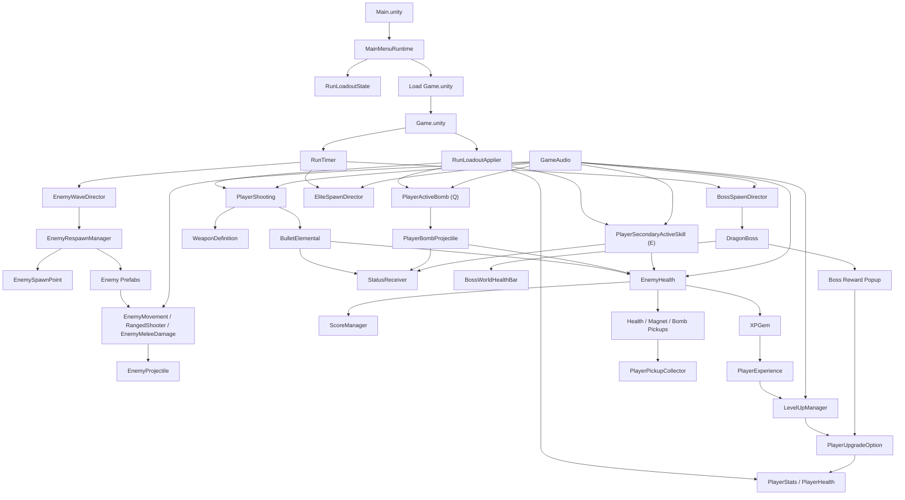
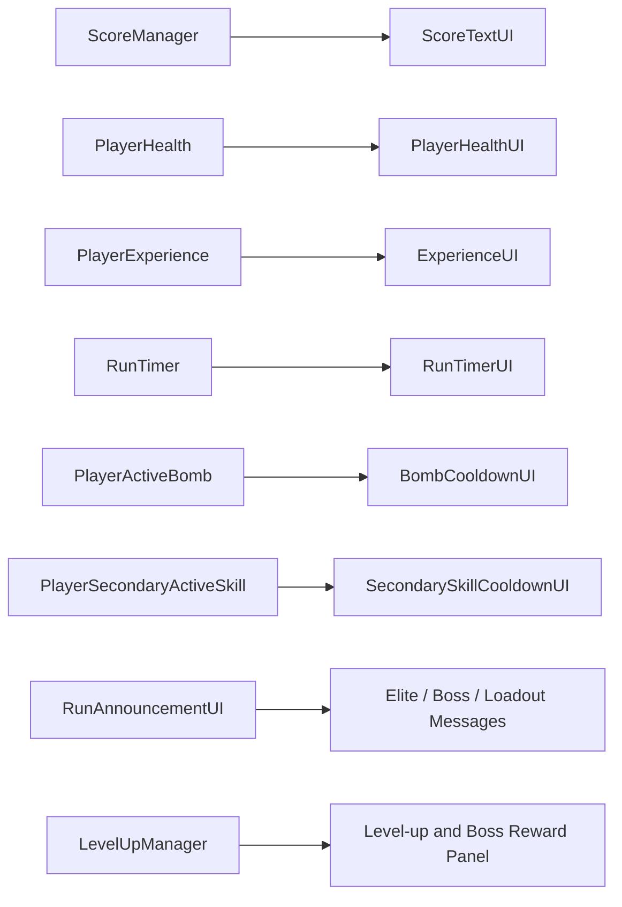
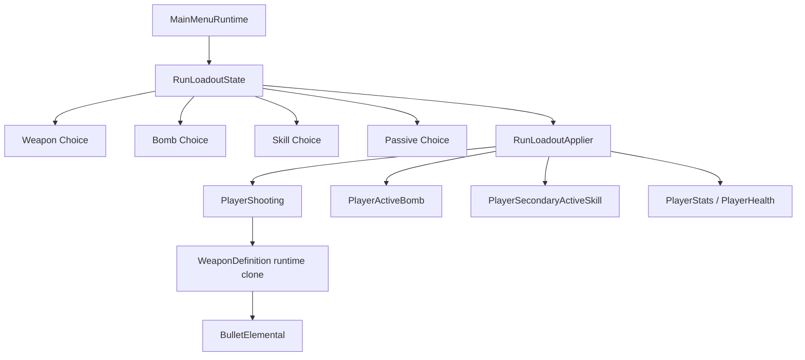
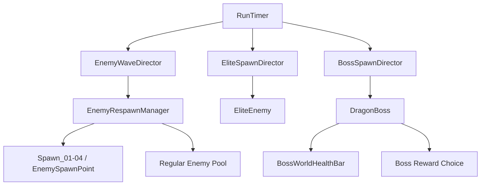

# System Graph

This page gives a high-level map of how the project's current systems connect. It is intentionally simplified so it can be pasted into a game design document or used as a technical orientation page.

## Scene / System Flow

## UI Ownership Graph

## Loadout Ownership Graph

## Enemy / Boss Escalation Graph

## Notes

- `Main.unity` is mostly runtime-generated UI.
- `Game.unity` is the real gameplay scene.
- several systems are bootstrap-only and do not need authored scene objects:
  - `RunLoadoutApplier`
  - `BossSpawnDirector`
  - `GameAudio`
  - `PlaySessionLogWriter`
  - `BombCooldownUI`
  - `SecondarySkillCooldownUI`
- the current loadout-selected weapon path uses:
  - `RunLoadoutState`
  - `RunLoadoutApplier`
  - `PlayerShooting`
  - `WeaponDefinition`
  - `BulletElemental`
